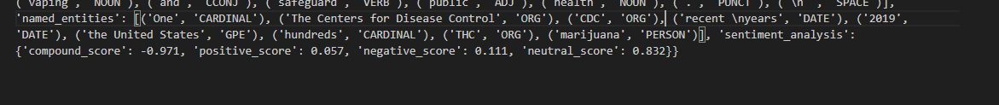

We globally need this if using PyPDF2 : 
```python
pip install PyPDF2 pandas nltk # Scraps data from the pdf file
```
Or :

```python

pip install pymupdf pandas nltk #If you go for pymupdf

```

unstructured_analysis: 

pip install nltk spacy

With this code, we're performing the following NLP tasks:

- Tokenization using spaCy.
- Part-of-speech tagging using spaCy.
- Named Entity Recognition (NER) using spaCy.
- Sentiment Analysis using NLTK's VADER sentiment analyzer.

Here's some output: 



